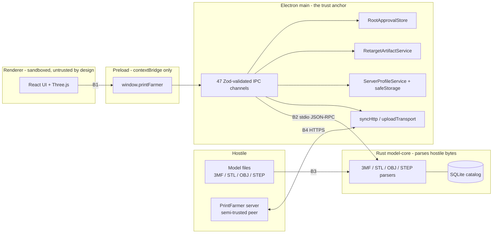

# PrintFarmer Desktop Threat Model

Status: living document. Last reviewed against `085d91a` (2026-07-25).

This is a threat model for **this** application, not a generic checklist. Every control is
cited by file and line so a reviewer can check it rather than take it on trust, and every
threat carries an honest **coverage** verdict — including the cases where a control exists but
nothing tests it. Those gaps are the work items, and they are collected in
[section 9](#9-open-work-derived-from-this-model).

[`docs/ARCHITECTURE.md`](../ARCHITECTURE.md) describes how the system works. This document
describes how someone would try to break it.

## 1. Scope

**In scope**

- The Electron main process, preload bridge, and renderer (`src/`).
- The Rust `model-core` sidecar (`native/model-core/`), its parsers, and its RPC transport.
- Data at rest under Electron's `userData` directory and the per-instance temporary retarget
  workspace.
- Network interaction with a PrintFarmer server: profile probing, JWT exchange, model upload,
  library sync.
- The build and dependency supply chain that produces a release artifact.

**Out of scope, with reasons**

- **Code signing, notarization, and update integrity.** `.github/workflows/release.yml` is
  titled "Release (unsigned)"; it has no signing or notarization step, and no updater
  dependency exists in `package.json`. There is no update channel to attack and no signature
  to verify. Tracked by #22. Until it lands, an attacker who can substitute the downloaded
  installer wins outright, and no control in this repository changes that.
- **The PrintFarmer server itself** — a separate service and repository. This model treats it
  as a _semi-trusted remote peer_: authenticated, but capable of returning hostile responses
  (section 7).
- **The printer.** Direct slicing, printer communication, and physical tool-change validation
  are outside the desktop trust boundary.
- **A compromised OS user account.** Anything running as the user can read `userData`, attach
  a debugger, and impersonate the app. `safeStorage` raises the cost of offline credential
  theft; it does not defeat a live local attacker.

## 2. System model and trust boundaries

| ID     | Boundary             | Crossing             | Why it matters                                                                                                                                                                                                      |
| ------ | -------------------- | -------------------- | ------------------------------------------------------------------------------------------------------------------------------------------------------------------------------------------------------------------- |
| **B1** | Renderer to main     | `contextBridge` IPC  | The renderer is the process most likely to be compromised — it renders untrusted geometry and remote strings. Everything it can reach, an attacker who owns it can reach.                                           |
| **B2** | Main to sidecar      | stdio JSON-RPC       | The sidecar runs with the user's full privileges and performs no authorization of its own. Main is entirely responsible for what it asks the sidecar to open.                                                       |
| **B3** | Model file to parser | `parse_bytes(&[u8])` | The only place in the product where fully attacker-controlled bytes meet hand-written parsing logic. Safe Rust, so the realistic outcomes are denial of service and logic corruption rather than memory corruption. |
| **B4** | Main to server       | HTTPS `fetch`        | Carries the bearer credential. A hostile or impersonated server sees the token and returns data that becomes local state.                                                                                           |

**The renderer is not trusted.** That is the load-bearing design decision.
`src/main/main.ts:66-75` sets `contextIsolation: true`, `nodeIntegration: false`,
`sandbox: true`, `webSecurity: true`, `allowRunningInsecureContent: false`, and
`src/preload/preload.ts` exposes only the typed `window.printFarmer` object — never
`ipcRenderer`, `require`, or any Node primitive. The consequence for the rest of this document
is that **"the renderer sends a hostile message" is the assumed baseline, not a worst case.**

## 3. Assets

| Asset                          | Where it lives                                                 | Loss means                                                   |
| ------------------------------ | -------------------------------------------------------------- | ------------------------------------------------------------ |
| PrintFarmer API key / password | `safeStorage`-encrypted envelope under `userData`              | Full account takeover on the server                          |
| Short-lived JWT                | Main-process memory only (`src/main/serverProfiles.ts:394`)    | Account access for the token's lifetime                      |
| The user's model library       | Arbitrary user-chosen folders on disk                          | Exfiltration of unreleased or commercially sensitive designs |
| Approved-root grants           | `approved-roots.v1.json` under `userData`                      | Widening the filesystem authority the app will exercise      |
| Catalog database               | SQLite under `userData`                                        | Metadata disclosure; corruption breaks the library           |
| Retarget artifacts             | Mode-`0700` per-instance directory under the OS temp directory | Disclosure or substitution of a project mid-workflow         |
| Release integrity              | The CI pipeline and the dependency graph                       | Supply-chain compromise of every user                        |

## 4. Adversaries

| ID     | Adversary                      | Capability assumed                                                                                                                                                             |
| ------ | ------------------------------ | ------------------------------------------------------------------------------------------------------------------------------------------------------------------------------ |
| **A1** | Hostile model file             | Full control of file bytes. Arrives by download, shared drive, or a model marketplace bundle. The user opens it deliberately, so no further social engineering is needed.      |
| **A2** | Compromised renderer           | Arbitrary JavaScript in the renderer — a dependency compromise or a rendering-path bug. Can call any `window.printFarmer` method with any argument, in any order, at any time. |
| **A3** | Hostile or impersonated server | Returns arbitrary bytes to any request. Includes a LAN attacker against an HTTP profile, and a genuine server that has since been compromised.                                 |
| **A4** | Local unprivileged process     | Runs as the same user but is not the app. Can race the filesystem, plant symlinks and reparse points, and read world-readable paths.                                           |
| **A5** | Supply-chain attacker          | Publishes a malicious version of a direct or transitive dependency, or compromises a git dependency's upstream.                                                                |

## 5. Threats at B1 — renderer to main

The renderer names **capabilities, never paths**: an opaque `approvalId`, a catalog SHA-256, an
opaque profile ID, or an artifact token. 47 channels are registered across 43
`ipcMain.handle` call sites (`src/main/ipc.ts:791-805` registers five upload-lifecycle
channels in one loop), but authority is concentrated in three capability classes. A
channel-by-channel enumeration would be mostly noise; these are the ones that matter.

### T1.1 — Renderer names an arbitrary filesystem path (A2)

**Attack.** Call `scanRoot`, `importRoot`, `loadScene`, `renderThumbnail`, or an upload with
`C:\Users\me\.ssh\id_rsa`, then read the result back through a scene, a thumbnail, or an
upload to an attacker-controlled server.

**Controls.** The renderer cannot express a path for these operations. `OpenFolder`
(`src/main/ipc.ts:664-693`) and `OpenModelFile` (`src/main/ipc.ts:695-724`) only _show the OS
picker_ and return what the user chose; every later operation resolves an approval ID or a
canonical picker file through `RootApprovalStore`. `authorizeFile`
(`src/main/rootApprovals.ts:189-224`) canonicalizes with `realpath` and requires containment
via `isWithinRoot` (`src/main/rootApprovals.ts:417-428`), which appends `path.sep` before the
prefix comparison so a sibling like `C:\library-evil` cannot pass for `C:\library`.
Picker-approved single files are tracked separately in `approvedPickerFiles`
(`src/main/ipc.ts:156-163`).

**Coverage. Store-level good, IPC-level absent.** `tests/rootApprovals.test.ts` covers
sibling-prefix escape, renderer-invented approvals, and ancestor swaps. But **no test in this
repository invokes `registerIpcHandlers`**, so nothing proves the _handlers_ consult the store
at all. A handler that called `fs.readFile(request.path)` directly would pass the entire
existing suite. → PR C.

### T1.2 — Renderer steals another window's retarget artifact (A2)

**Attack.** Obtain an artifact token belonging to a different `webContents` and call
`retargetBuild`, `retargetLoadScene`, or `retargetSaveAs` with it.

**Controls.** Tokens are 32 random bytes (`src/main/retargetArtifacts.ts:39`), bound to
`event.sender.id` at creation, and `lock()` returns `artifactForbidden` when
`record.owner !== owner` (`src/main/retargetArtifacts.ts:439`), backed by a 30-minute TTL
(`:440-443`) and a re-entrancy guard (`:444`).

**Coverage. Service-level yes, wiring no.** `tests/retargetArtifacts.test.ts:253` covers owner
binding and expiry at the service. The IPC wiring is untested: five handlers pass
`event.sender.id` into the service (`src/main/ipc.ts:346`, `:357`, `:367`, `:380`, `:391`), and
a handler that passed a constant instead would leave that service test green while collapsing
the control entirely. This is the "a different control fired than the one under test" failure
mode, one layer up. The same is true of the teardown path at `src/main/ipc.ts:338-344`, which
disposes an owner's artifacts when its `webContents` is destroyed. → PR C.

### T1.3 — Renderer exfiltrates credentials (A2)

**Attack.** Read the API key back through any IPC response, or provoke an error whose message
embeds the bearer token, then exfiltrate it through a rendered resource URL.

**Controls.** Secrets are encrypted at rest with `safeStorage` and appear in no response type
— `ListServerProfiles` returns redacted metadata only. JWTs exist solely in main-process
memory (`src/main/serverProfiles.ts:394`). Error text is replaced wholesale rather than
filtered: `scrubSensitiveText` (`src/main/uploadTransport.ts:640-644`) discards its input and
returns a constant, which is the right shape — a filter is a blocklist, and blocklists leak.
Every response is re-validated against its Zod schema before leaving main
(`src/shared/ipc.ts:1257-1441`), so an accidental extra field is dropped at the boundary.

**Coverage. Partial and indirect.** `tests/ipc.test.ts:31` validates the redacted profile
_schema_, which proves the contract forbids a secret. It does not prove the implementation
populates that contract correctly, and nothing asserts that no `console.*` call site in
`src/main` can emit a token, password, or API key. → PR C.

### T1.4 — Renderer forges a message from a frame that should not hold the API (A2)

**Status: residual, held up by analysis rather than by an implemented check.**

There is **no** `event.senderFrame` or sender-origin validation on any of the 47 channels;
Electron's own security guidance recommends one. Reachability is currently blocked
structurally instead: `nodeIntegrationInSubFrames` is left at its default of `false`, so a
subframe receives no preload and therefore no `ipcRenderer`; `setWindowOpenHandler` denies
every window open (`src/main/security.ts:36-41`); and `will-navigate` diverts non-internal
navigation to the OS browser (`src/main/security.ts:29-34`).

That is a chain of one unstated default plus two guards standing in for an absent control, and
the weakest link is the default — a future `webPreferences` edit could flip it with nothing in
CI noticing. Recorded here deliberately rather than filed as a defect: per this squad's
reviewer standard, an unreproduced risk is a non-blocking observation, not a rejection.
**Ruling requested** — add sender validation as defense in depth, or accept this residual with
the rationale above?

### T1.5 — Renderer navigates itself somewhere useful to an attacker (A2)

**Attack.** Set `location.href` to an attacker origin and inherit whatever the preload exposed,
or open a popup that does not carry the hardened preferences.

**Controls.** `hardenWindow` (`src/main/security.ts:28-47`) blocks non-internal
`will-navigate`, denies all window opens, and refuses every renderer permission request.
`applyContentSecurityPolicy` (`src/main/security.ts:61-86`) attaches `script-src 'self'`,
`object-src 'none'`, `base-uri 'none'`, and `frame-ancestors 'none'` in production, relaxing
only for the Vite dev server (`:93-113`). The packaged app additionally flips fuses
(`forge.config.ts:92-100`): `RunAsNode` off, `EnableNodeOptionsEnvironmentVariable` off,
`EnableNodeCliInspectArguments` off, `EnableEmbeddedAsarIntegrityValidation` on,
`OnlyLoadAppFromAsar` on.

**Coverage. None.** `src/main/security.ts` has no test at all. Nothing pins that the
production CSP omits `'unsafe-inline'`, and nothing would catch the _development_ policy being
served in production — one absent `devServerUrl` check away, and invisible to every existing
test. → PR C.

### T1.6 — Malformed or oversized IPC payload (A2)

**Controls.** Every request and response passes a strict Zod schema with explicit bounds:
`.strict()` rejects additive fields, string lengths are capped, and enums are closed
(`src/shared/ipc.ts:1257-1441`).

**Coverage. Good — the one part of the IPC surface with real coverage.**
`tests/ipc.test.ts` and `tests/retarget.ipc.test.ts` exercise this axis thoroughly. Both test
schemas in isolation and never register a handler, so they prove the _contract_, not the
_plumbing_ — which is why T1.1 through T1.5 above are uncovered despite these files existing.

## 6. Threats at B3 and B2 — hostile model files and the sidecar

The parsers are the deepest exposure to A1. They are written in safe Rust, so the realistic
outcomes are denial of service, resource exhaustion, and logic corruption rather than memory
corruption. `unsafe` appears in exactly one module, `native/model-core/src/threemf_lib3mf.rs`,
which is the optional `lib3mf` FFI path and is not compiled into the default build.

### T2.1 — Decompression bomb, path traversal, XML entity expansion (A1)

**Controls, delivered by #20** (`native/model-core/src/limits.rs`): a compression-ratio ceiling
`MAX_COMPRESSION_RATIO = 300` above a 4 MiB floor, an aggregate
`MAX_TOTAL_DECOMPRESSED_BYTES = 2 GiB`, `MAX_XML_DEPTH = 64`,
`MAX_XML_EVENTS = 200_000_000`, and a `DEFAULT_PARSE_TIMEOUT` of 120 seconds. Path traversal,
DTD and entity attacks, deep nesting, and component cycles are covered by
`native/model-core/tests/threemf_security.rs` with the fixtures `malformed_zip_bomb.3mf` and
`malformed_path_traversal.3mf`.

**Coverage. Good, and deliberately not rebuilt.** #20 is the strongest-tested area of the
product, including the harder cases where a cheap preflight guard shadows a stricter
accumulator on all honest input.

### T2.2 — Structurally valid input that reaches an untested code path (A1)

**Attack.** Not a bomb — a file well-formed enough to pass every limit above, which then drives
a parser state machine into a panic, an unbounded allocation, or a non-terminating loop.
Superlinear output is the shape to fear: in #68 a 29-node diamond DAG expanded to 32,767 rows
because the tests covered ancestor cycles and nobody had drawn a diamond.

**Controls.** The limits bound the obvious cases. Beyond them, correctness rests entirely on
hand-written parsing in `threemf.rs`, `stl.rs`, `obj.rs`, `step.rs`, and `vendor.rs`.

**Coverage. This is the real gap.** Coverage is example-based: fixtures encode the shapes their
authors imagined. There is no fuzzing anywhere in the tree. The recorded lesson from #69 is
exactly this failure — a non-finite-float corpus assembled from spellings (`NaN`, `inf`,
`Infinity`) missed `1e999`, which contains none of those substrings and still parses to
infinity. All five parsers expose clean byte entry points (`threemf::parse_bytes`,
`stl::parse_bytes`, `obj::parse_bytes`, `step::parse_bytes`, `vendor::extract_bytes`), so they
are directly fuzzable with no viewer or IPC scaffolding. → PR D.

### T2.3 — Sidecar is asked to open something it should not (A2 via B2)

The sidecar trusts main completely and performs no authorization of its own; everything
protecting it is section 5's approval checks. The transport is a private stdio pipe with
`windowsHide` (`src/main/sidecar.ts:1107-1117`) — no socket and no listening port, so A4
cannot reach it without already owning the process tree. Note the corollary: **any future
change that gives the sidecar a network or IPC listener invalidates this entire section.**

On Windows, the optional lib3mf loader hardens the DLL search path with
`SetDefaultDllDirectories` and scoped `AddDllDirectory` cookies
(`native/model-core/src/threemf_lib3mf.rs:1691-1728`), which closes the classic
DLL-planting path for A4.

### T2.4 — Imported Snapmaker profile carries executable or unsafe settings (A1)

**Controls.** Native inspection rejects executable post-processing settings before any imported
setting can enter a generated project. Generated projects always use manifest-verified machine
identity, dimensions, motion limits, tools, and G-code hooks from the pinned bundled snapshot
rather than imported values; imported motion values are clamped against those independent
ceilings, and filament temperatures and volumetric flow are capped by the corresponding pinned
material profile. Bundled profiles are pinned to commit `0c2d178` with a per-file SHA-256
manifest, verified at package time by `scripts/verify-packaged-sidecar.mjs` and on every pull
request by `npm run check:provenance` (`.github/workflows/ci.yml:27-28`).

**Coverage. Good.** `native/model-core/tests/retarget_integration.rs` covers clamping directly
(`every_mandatory_global_and_object_motion_setting_is_clamped`,
`per_object_motion_overrides_are_clamped_and_validated`) and includes a `../escape.model`
archive-traversal case.

## 7. Threats at B4 — network and remote data

### T3.1 — Credential theft in transit (A3)

**Controls.** `normalizeServerUrl` (`src/main/serverProfiles.ts:344-370`) rejects any URL that
is not `http:` or `https:`, or that embeds a username, password, query, or fragment — so a
profile can never smuggle a credential into a URL that later reaches a log or a redirect.
Certificate verification is never bypassed: there is no `rejectUnauthorized: false` and no
`NODE_TLS_REJECT_UNAUTHORIZED` anywhere in `src/`. The encrypted envelope binds each secret to
its profile ID, normalized URL, auth mode, and username identity, so an envelope copied onto a
different profile or endpoint does not decrypt into a usable credential.

**Residual, accepted, and visible to the user.** HTTP LAN profiles remain supported and carry
a persistent warning in the UI. On an HTTP profile, A3 as a LAN attacker sees the bearer
token. This is a deliberate usability trade for self-hosted setups, not an oversight.

### T3.2 — Hostile server response corrupts local state (A3)

**Controls.** Remote DTOs are parsed with tolerant schemas that accept additive server fields
and are then _transformed_ into the strict internal IPC and profile models rather than passed
through, so a server cannot inject a field that reaches the renderer. Batch sizes are bounded
(`src/main/syncHttp.ts:195`: apply batches must be 1..=500 operations). A missing
capability or version endpoint is treated as legacy and requires explicit user confirmation;
legacy availability exposes only the conservative model-file and server-thumbnail fallback and
keeps modern idempotent upload, client thumbnails, and library sync gated.

**Residual, accepted.** A compromised _authenticated_ server can still feed misleading tag and
collection metadata into the local catalog. Rejecting that would require a trust model the
product does not have.

### T3.3 — Token leaks into a log or a user-visible error (A3, A2)

**Controls.** `scrubSensitiveText` (`src/main/uploadTransport.ts:640-644`) replaces error text
wholesale. Main-process `console.error` calls use fixed strings rather than interpolating
state — for example `src/main/serverProfiles.ts:678` and `src/main/syncEngine.ts:325`.

**Coverage. None.** Nothing asserts that a token cannot reach stderr or an IPC error message.
The current safety rests on the discipline of every individual `console.error` call site,
which is precisely the class of invariant that decays silently as new call sites are added.
→ PR C.

## 8. Threats to the supply chain (A5)

### T4.1 — Malicious or licence-incompatible dependency

**Controls. None.** There is no `deny.toml`, no `cargo-audit`, no `npm audit` gate, and no
SBOM. Both lockfiles (`package-lock.json`, `native/Cargo.lock`) are committed and CI installs
with `npm ci`, so builds are reproducible — but nothing checks _what_ is being reproduced.

Two specifics raise the stakes:

- `lib3mf-ffi` is a **git** dependency pinned to rev
  `0f12d3c25c861198f80a34abf3699102529b6e87` (`native/model-core/Cargo.toml:45`), not published
  on crates.io. The rev pin is the right call, but a git source bypasses crates.io's
  publication controls entirely, and this is the one dependency reached over `unsafe` FFI.
- The product is **AGPL-3.0-only**. `docs/compliance/CORRESPONDING_SOURCE.md` requires notices
  to ship under `resources/compliance/`, and `THIRD_PARTY_NOTICES.md` currently discharges that
  by pointing at the lockfiles rather than enumerating licences. A GPL-2.0-**only** dependency
  would be licence-incompatible with AGPL-3.0-only outbound, and nothing today would detect one
  entering the graph.

→ PR B.

### T4.2 — The gate itself becomes the weak point

Advisory databases are fetched live, so an advisory-checking gate can fail a pull request that
changed nothing. A gate that blocks unrelated work gets disabled, and a disabled gate is worse
than no gate — the same failure shape as a cap that degrades into blanket rejection. The
mitigation is to separate deterministic checks (licences, bans, sources, and a
production-scoped audit against the committed lockfile) from live-database checks
(advisories), and to let only the deterministic ones block a pull request.

Note also that adding a job to `.github/workflows/ci.yml` does **not** make it a required
check. Branch protection lists the six required checks and must be updated separately by
someone with administrative rights. → PR B.

## 9. Open work derived from this model

| Threat           | Gap                                                                  | Where      |
| ---------------- | -------------------------------------------------------------------- | ---------- |
| T4.1, T4.2       | No SBOM, licence, or vulnerability gate                              | PR B (#21) |
| T1.1, T1.2, T1.5 | No test ever invokes an IPC handler; `src/main/security.ts` untested | PR C (#21) |
| T1.3, T3.3       | Credential non-egress asserted nowhere                               | PR C (#21) |
| T2.2             | No fuzzing; parser coverage is example-based                         | PR D (#21) |
| T1.4             | Sender validation absent — awaiting a ruling                         | undecided  |
| Out of scope     | No signing, notarization, or update integrity                        | #22        |

Every negative test written against this model must be shown to **fail when the control it
tests is removed**, with the mutation recorded in the pull request. For a security suite this
is not optional bookkeeping: a test that passes vacuously is worse than no test, because it
retires the concern.

## 10. Keeping this current

Revisit this document, and update the reviewed-at SHA at the top, when any of the following
changes:

- `webPreferences` in `src/main/main.ts`, or anything in `src/main/security.ts`.
- The set of IPC channels, or how any handler derives authority from its `event`.
- Fuse configuration in `forge.config.ts:92-100`.
- The sidecar transport — in particular anything that gives it a socket or a listening port,
  which invalidates T2.3.
- The introduction of code signing, notarization, or an update channel (#22), which invalidates
  section 1's out-of-scope reasoning entirely.
- Any new dependency reached over `unsafe`, or any new git or path dependency source.
