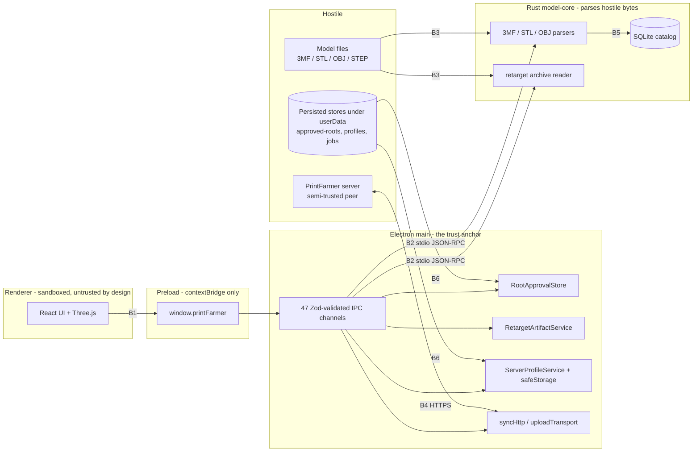

# PrintFarmer Desktop Threat Model

Status: living document. Last reviewed against `8c0b4ba` (2026-07-25).

This is a threat model for **this** application, not a generic checklist. Every control is
cited by a named symbol _and_ a line number so a reviewer can check it rather than take it on
trust — the symbol is the durable half, because a line number silently rots when the file
above it grows. Every threat carries an honest **coverage** verdict, including the cases where
a control exists but nothing tests it. Those gaps are the work items, and they are collected in
[section 9](#9-open-work-derived-from-this-model).

[`docs/ARCHITECTURE.md`](../ARCHITECTURE.md) describes how the system works. This document
describes how someone would try to break it.

## 1. Scope

**In scope**

- The Electron main process, preload bridge, and renderer (`src/`).
- The Rust `model-core` sidecar (`native/model-core/`), its parsers, and its RPC transport.
- Data at rest under Electron's `userData` directory and the per-instance temporary retarget
  workspace.
- Network interaction with a PrintFarmer server: profile probing, JWT exchange, model upload,
  library sync.
- The build and dependency supply chain that produces a release artifact.

**Out of scope, with reasons**

- **Code signing, notarization, and update integrity.** `.github/workflows/release.yml` is
  titled "Release (unsigned)"; it has no signing or notarization step, and no updater
  dependency exists in `package.json`. There is no update channel to attack and no signature
  to verify. Tracked by #22. Until it lands, an attacker who can substitute the downloaded
  installer wins outright, and no control in this repository changes that.
- **The PrintFarmer server itself** — a separate service and repository. This model treats it
  as a _semi-trusted remote peer_: authenticated, but capable of returning hostile responses
  (section 7).
- **The printer.** Direct slicing, printer communication, and physical tool-change validation
  are outside the desktop trust boundary.
- **A compromised OS user account.** Anything running as the user can read `userData`, attach
  a debugger, and impersonate the app. `safeStorage` raises the cost of offline credential
  theft; it does not defeat a live local attacker.

**The A4 boundary, stated precisely, because the entry above is easy to over-read.** A4 in
section 4 runs as the same user, so a careless reading of the exclusion above deletes A4
entirely — and that reading is what left every persisted store unmodelled in the first version
of this document. The line is:

- **Out of scope:** defeating a local attacker who has already decided to subvert PrintFarmer
  specifically. Such an attacker replaces the binary or attaches a debugger and no control here
  changes the outcome. This document does not claim otherwise.
- **In scope:** every control the code _already implements_ against local interference — the
  TOCTOU re-check in `openApprovedFile`, the device/inode identity binding in `authorizeFile`,
  the `0o700`/`0o600` modes on temp workspaces, the DLL-search hardening. These exist, they can
  regress silently, and a control that stops working is worse than one never claimed. Where
  such a control exists, this document must say what it defends and whether anything tests it.

The practical test: if the code takes a deliberate step to resist A4, that step is in scope.
If the answer to a threat is "an attacker at that level has already won", it is not.

## 2. System model and trust boundaries

| ID     | Boundary                | Crossing                                           | Why it matters                                                                                                                                                                                                                                                                                                                                                          |
| ------ | ----------------------- | -------------------------------------------------- | ----------------------------------------------------------------------------------------------------------------------------------------------------------------------------------------------------------------------------------------------------------------------------------------------------------------------------------------------------------------------- |
| **B1** | Renderer to main        | `contextBridge` IPC                                | The renderer is the process most likely to be compromised — it renders untrusted geometry and remote strings. Everything it can reach, an attacker who owns it can reach.                                                                                                                                                                                               |
| **B2** | Main to sidecar         | stdio JSON-RPC                                     | The sidecar runs with the user's full privileges and performs no authorization of its own. Main is entirely responsible for what it asks the sidecar to open.                                                                                                                                                                                                           |
| **B3** | Model file to parser    | `parse_bytes(&[u8])`, `ArchivePackage::from_bytes` | Where fully attacker-controlled bytes meet hand-written parsing logic. **Two** ingestion paths, not one — the catalog parsers behind `threemf::open_package`, and the retarget archive reader with its own ZIP constructor and its own limit set (T2.5). Safe Rust, so the realistic outcomes are denial of service and logic corruption rather than memory corruption. |
| **B4** | Main to server          | HTTPS `fetch`                                      | Carries the bearer credential. A hostile or impersonated server sees the token and returns data that becomes local state.                                                                                                                                                                                                                                               |
| **B5** | Catalog file to sidecar | `SqliteCatalog::open`                              | The catalog is persisted state that a local process can rewrite, at a path an environment variable can redirect. It is therefore _input_ to the migration chain, not merely storage (T2.6).                                                                                                                                                                             |
| **B6** | Persisted store to main | `JSON.parse` in five `src/main` modules            | Main reads its own state back off disk, including the store that _grants_ filesystem authority. A4 can rewrite those files, so they are input, not memory. Weakest boundary by design — see the A4 scope note in section 1 for why that is the accepted answer rather than a defect (T1.7).                                                                             |

Note that **B2 is bidirectional** and the diagram draws only the request direction: responses
travel back from the sidecar to main, so a sidecar subverted through B3 reaches main through B2
(`src/main/sidecar.ts:940`).

**The renderer is not trusted.** That is the load-bearing design decision.
`src/main/main.ts:66-75` sets `contextIsolation: true`, `nodeIntegration: false`,
`sandbox: true`, `webSecurity: true`, `allowRunningInsecureContent: false`, and
`src/preload/preload.ts` exposes only the typed `window.printFarmer` object — never
`ipcRenderer`, `require`, or any Node primitive. The consequence for the rest of this document
is that **"the renderer sends a hostile message" is the assumed baseline, not a worst case.**

### 2.1 How the ingestion list below was built, and what makes it closed

The first version of this document listed ingestion points **by inspection**, and review caught
the predictable result: it claimed `parse_bytes` was the only place attacker-controlled bytes
are parsed, and missed `retarget/archive.rs`. Adding the one missing entry would have left the
method unchanged and the next omission just as likely, so the list below is instead derived
from the dependency graph, which is what makes it closed rather than merely long.

**The argument.** Code cannot decode bytes without a decoder. The set of decoders available to
this product is bounded by its dependency graph, so enumerating decoder _crates_ first and their
call sites second yields a list whose completeness rests on something checkable, rather than on
how carefully someone read the tree.

**The manifests bound the _direct_ set; the lockfiles bound the transitive one, and the
distinction matters.** The enumeration below starts from `Cargo.toml` and `package.json`, so it
is only sound if no transitive dependency introduces a decoder the direct set does not imply.
Checked against `native/Cargo.lock`: the decoder-bearing transitive crates are `miniz_oxide`,
`fdeflate`, `flate2` and `libsqlite3-sys`, and each is reachable only through a direct
dependency already modelled here (`zip` and `png` → deflate, `rusqlite` → SQLite). `bzip2`,
`zstd`, `aes`, `image`, `jpeg-decoder`, `tiff` and `xml-rs` are all **absent**, which
independently confirms that `zip`'s `default-features = false` is doing its job. §8 covers both
lockfiles as supply-chain surface; §10's re-read trigger names the lockfiles for this reason,
since a transitive decoder can arrive through a version bump that touches no manifest.

1. **Rust decoders, from `native/model-core/Cargo.toml`.** The shipped build is
   `--features sqlite` (`scripts/stage-sidecar.mjs:38`, `.github/workflows/release.yml:47`),
   which excludes `truck-*` (STEP) and `lib3mf-ffi`. What remains that can consume bytes:
   `zip`, `quick-xml`, `serde_json`, `png`, `base64`, `rusqlite`. Everything else in the
   manifest — `sha2`, `walkdir`, `notify`, `same-file`, `thiserror`, `serde`, `tempfile`,
   `libloading` — either does not decode untrusted bytes or, in `libloading`'s case, belongs to
   the unshipped `lib3mf` path (T2.3).
2. **Call sites for each**, excluding `#[cfg(test)]` modules.
3. **Node decoders, from `package.json`.** The _application's own_ runtime dependencies are
   `react`, `react-dom`, `three`, and `zod` — **no archive, compression, or image library among
   them**. So in application code the only ways bytes become structure are `JSON.parse`,
   `Buffer.from(…, 'base64')`, and `three`'s geometry consumption in the renderer.

**That third bullet is scoped to the application's dependencies on purpose, because the platform
is not covered by it.** `electron` sits in `devDependencies` but is the shipped runtime, and it
bundles Chromium with a full complement of media decoders. The product uses one deliberately:
`src/renderer/library/useThumbnail.ts:114` builds `data:image/png;base64,${result.pngBase64}`
for an ``, and the CSP was written to permit exactly that (`img-src 'self' data: blob:`,
`src/main/security.ts:71`, and `:107` in the development variant). So "the product never decodes
a PNG" is false at the platform level even though it is true of `native/model-core`.

The reachability is narrow — those bytes come from the sidecar, not from a model file, so an
attacker needs the sidecar already subverted through B3. But that makes this **a third egress
from a subverted sidecar**, alongside the JSON-RPC response path at `src/main/sidecar.ts:940`:
`pngBase64` → `data:` URL → Chromium's PNG decoder. Chromium's own hardening is outside this
document's control and is treated as part of the platform, like V8 and the sandbox.

**One negative result worth recording, because it is the question a reader will ask.** `png` is
a dependency, but there is no `png::Decoder` anywhere in production code — the only use is
`png::Encoder` at `native/model-core/src/thumbnail.rs:145`. The sidecar _writes_ PNGs and never
parses them. On the Node side, thumbnail bytes are checked by magic number and `IHDR` rather
than decoded (`src/main/uploadTransport.ts:687-698`), with dimensions read from header offsets.
**No code this project wrote decodes an image**, which is the useful form of the claim — the
platform-level exception is the Chromium path noted above, and it is reachable only from an
already-subverted sidecar.

### 2.2 Ingestion inventory

| Door                                                           | Decoder      | Boundary | Adversary | Guard                           | Coverage             |
| -------------------------------------------------------------- | ------------ | -------- | --------- | ------------------------------- | -------------------- |
| `threemf::open_package` (`threemf.rs:906`)                     | `zip`        | B3       | A1        | `ParseGuard` + `limits.rs`      | Good (T2.1)          |
| 3MF/vendor XML (`threemf.rs`, `vendor.rs`)                     | `quick-xml`  | B3       | A1        | `ParseGuard` depth/event caps   | Good (T2.1)          |
| `stl` / `obj` `parse_bytes`                                    | hand-written | B3       | A1        | `ParseGuard`                    | Example-based (T2.2) |
| `ArchivePackage::from_bytes` (`archive.rs:106`)                | `zip`        | B3       | A1        | `RetargetLimits` only           | 2 of 12 (T2.5)       |
| Retarget XML (6 sites, T2.5)                                   | `quick-xml`  | B3       | A1        | **No depth, event or deadline** | **None (T2.5)**      |
| Retarget JSON (`project.rs:298`, `profile.rs:1304`)            | `serde_json` | B3       | A1        | Per-part size caps only         | **None (T2.5)**      |
| Catalog file (`SqliteCatalog::open`)                           | `rusqlite`   | B5       | A4, A3    | Version check + tx rollback     | Partial (T2.6)       |
| Catalog JSON columns (`sqlite_catalog.rs:390`, `:2963`)        | `serde_json` | B5       | A4, A3    | Fails closed on parse error     | Partial (T2.6)       |
| JSON-RPC requests (`serve.rs:1135`)                            | `serde_json` | B2       | A2 via B1 | Typed params + §5 authorization | Partial (T2.3)       |
| JSON-RPC responses (`sidecar.ts:940`)                          | `JSON.parse` | B2       | A1 via B3 | Ignores corrupt lines           | Partial (T2.3)       |
| Persisted main-process stores (5 files)                        | `JSON.parse` | B6       | A4        | Varies — see T1.7               | **None (T1.7)**      |
| Server responses (`syncHttp.ts:443`, `uploadTransport.ts:439`) | `JSON.parse` | B4       | A3        | Tolerant-then-transform DTOs    | Good (T3.2)          |

One boundary in that table is not drawn in the §2 diagram because it is a direction rather than
a new participant: **B2 carries responses back from the sidecar to main**, so a sidecar
subverted through B3 reaches main through it.

## 3. Assets

| Asset                              | Where it lives                                                                                | Loss means                                                                                  |
| ---------------------------------- | --------------------------------------------------------------------------------------------- | ------------------------------------------------------------------------------------------- |
| PrintFarmer API key / password     | `safeStorage`-encrypted envelope under `userData`                                             | Full account takeover on the server                                                         |
| Short-lived JWT                    | Main-process memory only (`src/main/serverProfiles.ts:394`)                                   | Account access for the token's lifetime                                                     |
| The user's model library           | Arbitrary user-chosen folders on disk                                                         | Exfiltration of unreleased or commercially sensitive designs                                |
| Approved-root grants               | `approved-roots.v1.json` under `userData`                                                     | Widening the filesystem authority the app will exercise. Also an _input_ surface — see T1.7 |
| Server profile + upload job stores | JSON under `userData` (`serverProfiles.ts`, `uploadJobs.ts`)                                  | Endpoint substitution and misdirected uploads. Also an _input_ surface — see T1.7           |
| Catalog database                   | SQLite under `userData`, path overridable by `PRINTFARMER_CATALOG_DB`                         | Metadata disclosure; corruption breaks the library. Also an _input_ surface — see T2.6      |
| Retarget artifacts                 | Mode-`0700` per-instance directory under the OS temp directory                                | Disclosure or substitution of a project mid-workflow                                        |
| Upload snapshot copies             | `upload-snapshots/` under `userData`, mode `0700` (`src/main/uploadSnapshot.ts:52`, `:56-57`) | Disclosure of the model library — these are byte-for-byte copies of user models. See T1.7   |
| Release integrity                  | The CI pipeline and the dependency graph                                                      | Supply-chain compromise of every user                                                       |

## 4. Adversaries

| ID     | Adversary                      | Capability assumed                                                                                                                                                                                                                                                                                                                                                                              |
| ------ | ------------------------------ | ----------------------------------------------------------------------------------------------------------------------------------------------------------------------------------------------------------------------------------------------------------------------------------------------------------------------------------------------------------------------------------------------- |
| **A1** | Hostile model file             | Full control of file bytes. Arrives by download, shared drive, or a model marketplace bundle. The user opens it deliberately, so no further social engineering is needed.                                                                                                                                                                                                                       |
| **A2** | Compromised renderer           | Arbitrary JavaScript in the renderer — a dependency compromise or a rendering-path bug. Can call any `window.printFarmer` method with any argument, in any order, at any time.                                                                                                                                                                                                                  |
| **A3** | Hostile or impersonated server | Returns arbitrary bytes to any request. Includes a LAN attacker against an HTTP profile, and a genuine server that has since been compromised.                                                                                                                                                                                                                                                  |
| **A4** | Local unprivileged process     | Runs as the same user but is not the app. Can **read and write** any file the user can, including everything under `userData`; can race the filesystem, plant symlinks and reparse points, and set environment variables for processes it starts. Its boundary is the subtlest one here — see the A4 scope note in section 1, which says exactly how much of this the product claims to resist. |
| **A5** | Supply-chain attacker          | Publishes a malicious version of a direct or transitive dependency, or compromises a git dependency's upstream.                                                                                                                                                                                                                                                                                 |

## 5. Threats at B1 — renderer to main

The renderer names **capabilities, never paths**: an opaque `approvalId`, a catalog SHA-256, an
opaque profile ID, or an artifact token. 47 channels are registered across 43
`ipcMain.handle` call sites (the upload-lifecycle loop at `src/main/ipc.ts:790` registers five
channels at once, so 42 + 5 = 47), but authority is concentrated in three capability classes. A
channel-by-channel enumeration would be mostly noise; these are the ones that matter.

### T1.1 — Renderer names an arbitrary filesystem path (A2)

**Attack.** Call `scanRoot`, `importRoot`, `loadScene`, `renderThumbnail`, or an upload with
`C:\Users\me\.ssh\id_rsa`, then read the result back through a scene, a thumbnail, or an
upload to an attacker-controlled server.

**Controls.** Two different mechanisms, and the distinction matters because slice 2 found a
channel where the second one was missing.

For _root-scoped_ operations the renderer genuinely cannot express a path: `OpenFolder`
(`src/main/ipc.ts:664`) and `OpenModelFile` (`src/main/ipc.ts:695`) only _show the OS picker_
and return what the user chose, and `ScanRoot` (`src/main/ipc.ts:443`) takes an `approvalId`,
never a path.

For _per-file_ operations the renderer **does** supply a path string — `LoadScene`,
`ExtractVendorMetadata`, `ExtractVendorPlateThumbnails` and `RenderThumbnail` all carry
`path: z.string().min(1).max(4096)`. The control is not that the path is inexpressible; it is
that each handler must _translate_ it through `authorizeRendererFile` (`src/main/ipc.ts:157`)
and forward only the returned canonical path to the sidecar. An earlier revision of this
document claimed "the renderer cannot express a path for these operations" as a single blanket
statement. That was wrong, and being wrong in the safe-sounding direction is what made it
costly: it described a property the code did not have, so it could not notice a channel that
lacked it.

`authorizeFile` (`src/main/rootApprovals.ts:189`) canonicalizes with `realpath` and requires
containment via `isWithinRoot` (`src/main/rootApprovals.ts:417`), which appends `path.sep`
before the prefix comparison so a sibling like `C:\library-evil` cannot pass for `C:\library`.
Picker-approved single files are tracked separately in `approvedPickerFiles`
(`src/main/ipc.ts:156`).

There is a third control here that is easy to miss, and it defends a different axis:
`authorizeFile` re-`realpath`s each **stored root** on every call and binds it to the
device/inode identity recorded at approval time via `matchesStoredIdentity`
(`src/main/rootApprovals.ts:207-209`), skipping any root that no longer matches. Containment
answers "is this file under an approved root"; identity binding answers "is this still the same
root I approved". A root swapped for a symlink or a different volume after approval fails the
second check even though it would pass the first. Both need proving separately — a test that
only varies the path exercises containment and leaves identity binding unmeasured.

**Finding (slice 2, fixed in the same PR).** `ExtractVendorPlateThumbnails` forwarded
`request.path` straight to the sidecar, with no `authorizeRendererFile` call, from its
introduction in `9fe0c99` (#36) until slice 2. Its three sibling handlers all authorized. No
contract test could have caught it: `ExtractVendorPlateThumbnailsRequest` (`src/shared/ipc.ts:301`)
and `ExtractVendorMetadataRequest` (`src/shared/ipc.ts:272`) are identical schemas, so the
difference existed only in the handler body — the layer `tests/ipc.test.ts` does not execute.
The chain was `preload.ts` → `src/main/ipc.ts` → `src/main/sidecar.ts:301` →
`native/model-core/src/serve.rs:816` → `vendor::read_plate_thumbnails_file`, with no
authorization at any layer, consistent with B2's statement that the sidecar performs none of
its own. Impact was bounded — an arbitrary-file-**open** primitive giving existence probing, an
error oracle, and content disclosure for files that parse as 3MF — not general file read. No
renderer code called the channel, which is why it stayed invisible: nothing would have broken.

**Coverage. Now proven at the IPC level.** `tests/rootApprovals.test.ts` covers sibling-prefix
escape, renderer-invented approvals, ancestor swaps, and — added in slice 2 — identity
substitution behind an unchanged path, which isolates `matchesStoredIdentity` from containment.
`tests/ipc.authz.test.ts` invokes `registerIpcHandlers` and asserts, uniformly across all four
path-carrying channels, that an unapproved path is refused _without the sidecar being invoked_
and that the canonical path rather than the renderer's string is forwarded. Removing the
authorization call from any of the four turns the suite red (M1–M4 in the slice-2 mutation
table). The prior claim that "a handler that called `fs.readFile(request.path)` directly would
pass the entire existing suite" was true when written, and is no longer true.

**A control on this threat that §1 obliges me to record, and which was missing until round 4.**
`retargetDialogs()` (`src/main/ipc.ts:55-88`) reads `PRINTFARMER_E2E_SAVE_DIALOGS` and
`PRINTFARMER_E2E_OPEN_DIALOGS` from the environment and pre-seeds file-dialog results from them.
If reachable in a release build it would hand A4 — credited in §4 with setting environment
variables — the ability to make the app "choose" files without the user, which is precisely the
consent grant this threat depends on.

It is double-gated, and both gates are real. `__PRINTFARMER_E2E_BUILD__` is a build-time define
(`vite.main.config.ts:12-14`, set from `PRINTFARMER_BUILD_E2E === '1'`), so in a release bundle
the branch is constant-folded out and the environment variables are never read at all; and
`process.env.PRINTFARMER_E2E !== '1'` guards it again at runtime (`ipc.ts:59`). The build-time
gate is the load-bearing one, because it removes the code rather than skipping it.

**Coverage. None, and this is the kind that regresses invisibly** — one build script exporting
`PRINTFARMER_BUILD_E2E` and the fold stops happening, with no test failing and nothing in a diff
to notice. → PR C: assert that a production-configured bundle contains no reference to
`PRINTFARMER_E2E_OPEN_DIALOGS`. That is a build-output assertion rather than a unit test, which
makes it unusual for this repo, but it is the only place the guarantee actually lives.

### T1.2 — Renderer steals another window's retarget artifact (A2)

**Attack.** Obtain an artifact token belonging to a different `webContents` and call
`retargetBuild`, `retargetLoadScene`, or `retargetSaveAs` with it.

**Controls.** Tokens are 32 random bytes (`src/main/retargetArtifacts.ts:39`), bound to
`event.sender.id` at creation, and `lock()` returns `artifactForbidden` when
`record.owner !== owner` (`src/main/retargetArtifacts.ts:439`), backed by a 30-minute TTL
(`:440-443`) and a re-entrancy guard (`:444`).

**Coverage. Service-level and wiring both proven; teardown still not.**
`tests/retargetArtifacts.test.ts:253` covers owner binding and expiry at the service.
`tests/ipc.authz.test.ts` now covers the wiring: each of the five handlers
(`src/main/ipc.ts:346`, `:357`, `:367`, `:380`, `:391`) is invoked from two different senders
and must forward both distinct ids, so a handler passing a constant — including a captured
first-caller id — fails. M5 and M6 in the slice-2 mutation table confirm it: replacing
`event.sender.id` with a literal turns the suite red.

The teardown path at `src/main/ipc.ts:338-344`, which disposes an owner's artifacts when its
`webContents` is destroyed, remains **untested**. The slice-2 harness stubs `event.sender.once`
rather than firing `destroyed`, so nothing yet proves disposal happens. → still open.

### T1.3 — Renderer exfiltrates credentials (A2)

**Attack.** Read the API key back through any IPC response, or provoke an error whose message
embeds the bearer token, then exfiltrate it through a rendered resource URL.

**Controls.** Secrets are encrypted at rest with `safeStorage` and appear in no response type
— `ListServerProfiles` returns redacted metadata only. JWTs exist solely in main-process
memory (`src/main/serverProfiles.ts:394`). Error text is replaced wholesale rather than
filtered: `scrubSensitiveText` (`src/main/uploadTransport.ts:641`) discards its input and
returns a constant, which is the right shape — a filter is a blocklist, and blocklists leak.
Every response is re-validated against its Zod schema before leaving main (`ipcSchemas`,
`src/shared/ipc.ts:1256`), so an accidental extra field is dropped at the boundary.

**Coverage. Partial and indirect.** `tests/ipc.test.ts:31` validates the redacted profile
_schema_, which proves the contract forbids a secret. It does not prove the implementation
populates that contract correctly, and nothing asserts that no `console.*` call site in
`src/main` can emit a token, password, or API key. → PR C.

### T1.4 — Renderer forges a message from a frame that should not hold the API (A2)

**Status: residual, held up by analysis rather than by an implemented check.**

There is **no** `event.senderFrame` or sender-origin validation on any of the 47 channels;
Electron's own security guidance recommends one. Reachability is currently blocked
structurally instead, by three separate things: `nodeIntegrationInSubFrames` is left at its
default of `false`, so a subframe receives no preload and therefore no `ipcRenderer`;
`setWindowOpenHandler` denies every window open, both on the main window
(`hardenWindow`, `src/main/security.ts:36-41`) and process-wide for _every_ web contents via
the `app.on('web-contents-created', …)` handler at `src/main/main.ts:283-285`; and
`will-navigate` diverts non-internal navigation to the OS browser
(`src/main/security.ts:29-34`).

That is a chain of one unstated default plus three guards standing in for an absent control,
and the weakest link is the default — a future `webPreferences` edit could flip it with nothing
in CI noticing. Recorded here deliberately rather than filed as a defect: per this squad's
reviewer standard, an unreproduced risk is a non-blocking observation, not a rejection.

**Ruling given (slice 2): the cheap option was taken.** `tests/mainWindow.security.test.ts`
asserts `nodeIntegrationInSubFrames` is falsy on the options passed to `new BrowserWindow`,
alongside `contextIsolation`, `nodeIntegration`, `sandbox`, `webSecurity` and
`allowRunningInsecureContent`. The assertion is on falsiness rather than `=== false`, because
the value is legitimately absent today; it fails if anyone sets it to `true`. Setting it true
turns the suite red (M11), as does disabling `sandbox` (M12). The process-wide window-open
denial at `src/main/main.ts:283-285` is asserted separately from the per-window handler, using
a WebContents that never passes through `hardenWindow` (M13).

**Residual, unchanged.** Full `senderFrame` validation is still absent, deliberately: no repro
was built, and per this squad's reviewer standard an unreproduced risk is a non-blocking
observation. What changed is only that the unstated default is now pinned by CI, which is the
weakest link named above — not the absent control itself.

### T1.5 — Renderer navigates itself somewhere useful to an attacker (A2)

**Attack.** Set `location.href` to an attacker origin and inherit whatever the preload exposed,
or open a popup that does not carry the hardened preferences.

**Controls.** `hardenWindow` (`src/main/security.ts:28-47`) blocks non-internal
`will-navigate`, denies all window opens, and refuses every renderer permission request.
`applyContentSecurityPolicy` (`src/main/security.ts:61-86`) attaches `script-src 'self'`,
`object-src 'none'`, `base-uri 'none'`, and `frame-ancestors 'none'` in production, relaxing
only for the Vite dev server (`developmentCsp`, `src/main/security.ts:93-113`). The packaged
app additionally flips fuses (`forge.config.ts:92-100`): `RunAsNode` off,
`EnableNodeOptionsEnvironmentVariable` off, `EnableNodeCliInspectArguments` off,
`EnableEmbeddedAsarIntegrityValidation` on, `OnlyLoadAppFromAsar` on.

**Coverage. Now proven, except the fuses.** `tests/security.test.ts` covers `hardenWindow` and
`applyContentSecurityPolicy`: off-origin `will-navigate` is cancelled and diverted to the OS
browser, `file:` and the configured dev-server origin are permitted (so a listener that
cancelled unconditionally would fail rather than pass), every window open is denied, and
permission requests are refused. The CSP assertions name the **directive**, not the policy
string: `script-src` must be exactly `'self'` while `style-src` is separately asserted to
_carry_ `'unsafe-inline'` (`src/main/security.ts:70`), since that concession is deliberate and a
policy-wide search for the token would fail on correct input. A paired assertion runs the same
check against both branches so the development relaxation cannot leak into the packaged policy.
M7–M10 confirm each of these turns the suite red when its control is removed.

The packaged **fuses** (`forge.config.ts:92-100`) remain unasserted — they are build
configuration, not runtime code, and nothing in the test suite reads them. → still open.

### T1.6 — Malformed or oversized IPC payload (A2)

**Controls.** Every request and response passes a strict Zod schema with explicit bounds:
`.strict()` rejects additive fields, string lengths are capped, and enums are closed
(`ipcSchemas`, `src/shared/ipc.ts:1256`).

**Coverage. Good — the one part of the IPC surface with real coverage.**
`tests/ipc.test.ts` and `tests/retarget.ipc.test.ts` exercise this axis thoroughly. Both test
schemas in isolation and never register a handler, so they prove the _contract_, not the
_plumbing_. Slice 2 closed that gap for T1.1, T1.2, T1.4 and T1.5 by invoking
`registerIpcHandlers` directly in `tests/ipc.authz.test.ts`; T1.3 and T1.7 remain contract-only.

### T1.7 — Local process rewrites a persisted main-process store (A4)

**This threat exists because of the enumeration in 2.1, not because of a specific bug.** Main
reads five JSON stores back off disk, and every one of them is a file A4 can rewrite:

| Store                          | Read at                                    | What tampering buys                   |
| ------------------------------ | ------------------------------------------ | ------------------------------------- |
| `approved-roots.v1.json`       | `src/main/rootApprovals.ts:455`            | Filesystem authority — the T1.1 grant |
| Server profile store           | `src/main/serverProfiles.ts:1383`, `:1629` | Endpoint and auth-mode substitution   |
| Decrypted secret envelope      | `src/main/serverProfiles.ts:1562`          | Credential handling paths             |
| Upload job store               | `src/main/uploadJobs.ts:1827`              | Upload targets and retry state        |
| Retarget artifact owner marker | `src/main/retargetArtifacts.ts:675`        | Artifact ownership — the T1.2 grant   |

The approved-roots store is the one that matters most, because it is the _source_ of the
authority T1.1 spends so much care spending correctly. Every control in T1.1 assumes the store
is honest.

**Controls, and they are uneven.** Parsing fails closed rather than throwing —
`rootApprovals.ts:453-458` returns `null` on malformed JSON instead of propagating, so a corrupt
store degrades to "no approvals" rather than crashing main. `authorizeFile` re-`realpath`s and
re-`lstat`s on every call, so a **stale** identity in the store is rejected (T1.1). Temp
workspaces are created `0o700` with files `0o600` (`retargetArtifacts.ts:160`, `:168`, `:644`),
and the secret envelope is bound to profile ID, URL, auth mode, and username (T3.1), so copying
one between profiles does not yield a usable credential.

**The honest limit.** No store is integrity-protected — there is no HMAC or signature anywhere
in `src/main`, and the identity binding does not help against an attacker who writes the store,
since that attacker chooses the recorded `dev`/`ino` as well as the path. Per the A4 scope note
in section 1, that is **the correct outcome, not a defect**: an attacker who can write
`userData` has already won by simpler means, and adding an HMAC whose key sits beside the data
would be security theatre. The `0o700`/`0o600` modes are also explicitly skipped on Windows
(`retargetArtifacts.ts:657`), which is a documented platform difference rather than an
oversight.

**Coverage. None, on the axis that matters.** `tests/rootApprovals.test.ts` covers _semantic_
tampering (renderer-invented approvals, ancestor swaps). Nothing feeds any of these five
readers a malformed, truncated, or type-confused JSON document. The fail-closed behaviour at
`rootApprovals.ts:453-458` is a real control that nothing tests, and it is the kind that
silently becomes a `throw` during a refactor. → PR C, and it is cheap: these are pure functions
over file contents, requiring none of the Electron harness the rest of PR C needs.

**One non-JSON store belongs here too: the upload snapshot directory.** `upload-snapshots/`
under `userData` (`src/main/uploadSnapshot.ts:52`) holds byte-for-byte `${id}.model` copies of
the user's models (`:96`), staged for upload. It is the same asset class as the retarget temp
directory and is defended the same way — `0o700` on the root (`:56-57`) and per job (`:116-117`),
with files opened `O_EXCL` at `0o600` (`:118-123`). It reads no JSON, so it is not one of the
five above; it is listed because §1 requires that a control the code implements against A4 be
recorded with what it defends and whether anything tests it.

Its coverage is **behavioural yes, control no** — a distinction worth stating precisely, because
"untested" would be false. `tests/uploadSnapshot.test.ts` covers snapshot lifecycle thoroughly:
cleanup after upload, retention when an equal-metadata pathname is replaced, cleanup on cancel,
stale-directory sweeping, and cleanup retry. But **no test in the repository asserts any file
mode at all** — `0o700` and `0o600` appear in no test file. The modes are the control, and they
are the part nothing pins. → PR C, alongside the same gap on retarget artifacts.

## 6. Threats at B3 and B2 — hostile model files and the sidecar

The parsers are the deepest exposure to A1. They are written in safe Rust, so the realistic
outcomes are denial of service, resource exhaustion, and logic corruption rather than memory
corruption. `unsafe` appears in exactly one module, `native/model-core/src/threemf_lib3mf.rs`,
which is the optional `lib3mf` FFI path. That module is not merely off by default: the feature
is `optional` with no `default` feature set, and both `scripts/stage-sidecar.mjs:38` and
`.github/workflows/release.yml:47` build `--features sqlite`, so **no `unsafe` code ships at
all**. (Beware the synonym trap when checking this: `retarget/{archive,guardrails,profile}.rs`
match a search for `unsafe` because they use the identifiers `unsafe_path_error` and
`unsafe_value`, which are error constructors, not unsafe blocks.)

**The invariant that makes this section tractable.** Catalog-side 3MF ingestion has exactly one
ZIP constructor: `threemf::open_package` (`native/model-core/src/threemf.rs:901`), which reads
each entry through the per-chunk `read_entry_guarded` (`:814`). This is not incidental — #69
found four separate `ZipArchive::new` sites in `vendor.rs`, one of which had a hole the others
did not, and the fix was structural rather than local so that a fifth door could not
reintroduce the bug. Every limit in T2.1 hangs off that single constructor.

**There is one deliberate exception, and it must stay visible: `retarget/archive.rs`.** It is
the second production ZIP constructor in the tree and it does not go through `open_package`.
See T2.5. A search that expects `open_package` to be the only door will not find it.

### T2.1 — Decompression bomb, path traversal, XML entity expansion (A1)

**Controls, delivered by #20** (`native/model-core/src/limits.rs`): a compression-ratio ceiling
`MAX_COMPRESSION_RATIO = 300` above a 4 MiB floor, an aggregate
`MAX_TOTAL_DECOMPRESSED_BYTES = 2 GiB`, `MAX_XML_DEPTH = 64`,
`MAX_XML_EVENTS = 200_000_000`, and a `DEFAULT_PARSE_TIMEOUT` of 120 seconds. Path traversal,
DTD and entity attacks, deep nesting, and component cycles are covered by
`native/model-core/tests/threemf_security.rs` with the fixtures `malformed_zip_bomb.3mf` and
`malformed_path_traversal.3mf`.

**Coverage. Good, and deliberately not rebuilt.** #20 is the strongest-tested area of the
product, including the harder cases where a cheap preflight guard shadows a stricter
accumulator on all honest input.

**Scope of these controls, which is narrower than it looks.** Every limit above is enforced by
`ParseGuard` on the `threemf::open_package` path. The retarget archive reader does not use
`ParseGuard` and does not read `limits.rs` at all; it enforces a separate, independently
maintained set. T2.5 covers it. Read "the ZIP-bomb work is done" as scoped to this path only.

### T2.2 — Structurally valid input that reaches an untested code path (A1)

**Attack.** Not a bomb — a file well-formed enough to pass every limit above, which then drives
a parser state machine into a panic, an unbounded allocation, or a non-terminating loop.
Superlinear output is the shape to fear: in #68 a 29-node diamond DAG expanded to 32,767 rows
because the tests covered ancestor cycles and nobody had drawn a diamond.

**Controls.** The limits bound the obvious cases. Beyond them, correctness rests entirely on
hand-written parsing in `threemf.rs`, `stl.rs`, `obj.rs`, and `vendor.rs`.

`step.rs` is the exception on two counts, and both narrow the fuzzing scope. It is gated behind
`#[cfg(feature = "step")]` (`native/model-core/src/lib.rs:25`), and neither
`scripts/stage-sidecar.mjs:38` nor `.github/workflows/release.yml:47` enables that feature — so
the **shipped** sidecar exposes four hand-written byte entry points, not five. It is also not
hand-written: it delegates to the `truck-*` CAD kernel, which makes STEP primarily an A5
supply-chain surface (T4.1) rather than an A1 parsing surface. Fuzzing a module that does not
ship, to exercise a third-party kernel, is the wrong place to spend the effort first.

**Coverage. This is the real gap.** Coverage is example-based: fixtures encode the shapes their
authors imagined. There is no fuzzing anywhere in the tree. The recorded lesson from #69 is
exactly this failure — a non-finite-float corpus assembled from spellings (`NaN`, `inf`,
`Infinity`) missed `1e999`, which contains none of those substrings and still parses to
infinity. The shipped parsers expose clean byte entry points (`threemf::parse_bytes`,
`stl::parse_bytes`, `obj::parse_bytes`, `vendor::extract_bytes`), so they are directly fuzzable
with no viewer or IPC scaffolding. → PR D.

### T2.3 — Sidecar is asked to open something it should not (A2 via B2)

The sidecar trusts main completely and performs no authorization of its own; everything
protecting it is section 5's approval checks. The transport is a private stdio pipe with
`windowsHide` (`src/main/sidecar.ts:1107-1117`) — no socket and no listening port, so A4
cannot reach it without already owning the process tree. Note the corollary: **any future
change that gives the sidecar a network or IPC listener invalidates this entire section.**

On Windows, the optional lib3mf loader hardens the DLL search path with
`SetDefaultDllDirectories` and scoped `AddDllDirectory` cookies
(`native/model-core/src/threemf_lib3mf.rs:1691-1728`), which closes the classic
DLL-planting path for A4.

### T2.4 — Imported Snapmaker profile carries executable or unsafe settings (A1)

**Controls.** Native inspection rejects executable post-processing settings before any imported
setting can enter a generated project. Generated projects always use manifest-verified machine
identity, dimensions, motion limits, tools, and G-code hooks from the pinned bundled snapshot
rather than imported values; imported motion values are clamped against those independent
ceilings, and filament temperatures and volumetric flow are capped by the corresponding pinned
material profile. Bundled profiles are pinned to commit `0c2d178` with a per-file SHA-256
manifest, verified at package time by `scripts/verify-packaged-sidecar.mjs` and on every pull
request by `npm run check:provenance` (`.github/workflows/ci.yml:27-28`).

**Coverage. Good.** `native/model-core/tests/retarget_integration.rs` covers clamping directly
(`every_mandatory_global_and_object_motion_setting_is_clamped`,
`per_object_motion_overrides_are_clamped_and_validated`) and includes a `../escape.model`
archive-traversal case.

### T2.5 — The second archive reader, with its own limits and no tests (A1)

**This is the entry point the "ZIP hardening is done" story misses.** Retarget ingestion does
not go through `threemf::open_package`. `ArchivePackage::from_bytes`
(`native/model-core/src/retarget/archive.rs:102`) calls `ZipArchive::new` directly at `:106`.
Those are the only two ZIP constructors in production code; the other three matches in the tree
are inside `#[cfg(test)]` modules in `threemf.rs`.

**Reachable from the renderer**, via user-chosen files: `RetargetPreflight`, `RetargetBuild`,
`RetargetLoadScene`, and `RetargetSaveAs` (`src/shared/ipc.ts:56-62`) reach it through
`retarget/preflight.rs:50-51`, `retarget/mod.rs:269-272`, `retarget/validate.rs:24-25` and
`:49-50`, and `retarget/profile.rs:758`. The bytes are A1's, in full.

**Controls, and they are thorough.** `RetargetLimits` (`native/model-core/src/retarget/mod.rs:30`)
is a genuinely careful control set, independently written: part-name validation as the first
per-entry check (`validate_part_name`, called at `archive.rs:116`, defined at `:430`), a 512 MiB
source cap (`archive.rs:103`), a 10,000-part cap (`:107`), per-part caps (`:147-152`), a 1 GiB
aggregate uncompressed cap (`:153-160`), and rejection of encrypted entries (`:117-123`),
directory entries (`:124-128`), non-regular and symlink modes (`:129-136`), compression methods
other than Stored and Deflate (`:137-146`), and case-equivalent duplicate part names
(`:161-166`). It also catches declared-versus-streamed size disagreement in **both** directions
— a short read at `:177-183` and trailing extra bytes at `:186-193` — which is the exact class
#20 hardened on the catalog path. This reader is not sloppy work.

**The problem is that it is a _second_ implementation, and nothing holds the two together.** It
never reads `limits.rs`, so the two limit sets can drift with nothing comparing them. They have
already diverged on one axis: `RetargetLimits` has **no compression-ratio ceiling** and **no
parse deadline**, where the catalog path enforces `MAX_COMPRESSION_RATIO = 300` and a
120-second `DEFAULT_PARSE_TIMEOUT`. Expansion is still bounded in absolute terms by the 1 GiB
aggregate cap, so this is a materially weaker bound rather than an unbounded one — but a small
archive expanding to 1 GiB is a ratio the catalog path would refuse, and no deadline bounds the
time spent doing it.

**The ZIP layer is only the outermost of three, which the first version of this threat missed.**
Enumerating decoders per 2.1 rather than stopping at the door named in review shows the retarget
path decodes attacker bytes three times, and **the entire `retarget` module references no
`ParseGuard`, no `crate::limits`, no `MAX_XML_*` constant and no deadline** — its only import
named "limits" is its own `RetargetLimits`:

- **ZIP**, at `archive.rs:106` (`ZipArchive::new` — one of exactly two in
  `native/model-core/src/`), as above.
- **XML**, at six production sites. `rg 'Reader::from_(reader|str)' native/model-core/src/retarget/`
  returns exactly these six and nothing else: `archive.rs:217`, `:290`, `:569`, `:638`,
  `project.rs:479`, `transform.rs:370`. The catalog path caps XML at `MAX_XML_DEPTH = 64` and
  `MAX_XML_EVENTS`, charged through `ParseGuard`. These six have **no depth cap, no event
  budget, and no deadline.**
- **JSON**, at `project.rs:298` and `profile.rs:1304`
  (`rg 'serde_json::from_slice' native/model-core/src/retarget/` returns four; the other two are
  `profile.rs:356`, the on-disk profile manifest, and `:358`, a compiled-in constant that is not
  attacker input).

The grep expressions above are given in place of bare line numbers deliberately: line numbers
decay on every merge — #78 moved them in `threemf.rs` one commit after this document was first
written — while an expression that returns a known count stays checkable.

Input size is still bounded — per-part caps mean the XML and JSON layers see at most 16 MiB of
project settings or 256 MiB of a part, not unbounded input. So this is **an unmeasured risk, not
a demonstrated vulnerability**, and it is deliberately written that way: whether 16 MiB of
pathologically nested XML costs unacceptable time or stack in these specific handlers is exactly
the question fuzzing answers and inspection does not. T2.1's statement that XML nesting attacks
are handled is true of the catalog path and **false of this one**.

**Coverage. Two controls incidentally pinned, the rest unproven — and this verdict was
measured, not read off the source.** `archive.rs` has no unit tests of its own (zero `#[test]`,
zero `#[cfg(test)]`), but two of its controls are pinned from the integration suite:

- **Part-name traversal rejection** (`archive.rs:116`), by the `../escape.model` case in
  `rejects_geometry_only_presliced_and_unsafe_paths`
  (`native/model-core/tests/retarget_integration.rs:509-520`) — the same test T2.4 cites.
- **The per-part cap** (`archive.rs:147-152`), by
  `rejects_oversized_control_parts_during_archive_loading`
  (`native/model-core/tests/retarget_integration.rs:767-782`), which builds
  `RetargetLimits { max_project_settings_bytes: 64, .. }` and asserts `ArchiveLimitExceeded`.

**Everything else is unproven**: the source cap, the part-count cap, the aggregate uncompressed
cap, encrypted/directory/special-mode/compression-method rejection, case-duplicate rejection,
both directions of the declared-versus-streamed size check — **and all six XML sites and both
JSON sites**, which have no controls to test in the first place.

The split above was established by mutation rather than by reading: disabling each of the two
pinned controls individually fails exactly the test named beside it, and **disabling all ten
remaining controls simultaneously leaves the entire 368-test suite green**. Because these are
early-return rejections, removing them only makes the reader more permissive — so if disabling
all ten breaks no test, disabling any subset breaks none either. Method recorded because an
earlier version of this paragraph asserted a coverage verdict that was false in both directions;
a coverage claim is exactly the kind that must be measured.

This is still the sharpest gap in the document, and the true version is **stronger** than the
false one it replaces: two ZIP-layer controls hold, while the XML and JSON layers behind them
have neither controls nor tests.

→ PR D must fuzz `ArchivePackage::from_bytes` **and reach the XML and JSON layers behind it**,
not just the ZIP door, and should add the differential check no test currently makes: that the
two limit sets stay in a documented relationship rather than drifting apart silently. Whether
the retarget path should adopt `ParseGuard` outright is a design question for its own issue,
not something to settle inside a test PR.

### T2.6 — Hostile or corrupt catalog database (A4, A3)

**Attack.** The catalog is not only storage; it is input. Its path is environment-overridable —
`src/main/main.ts:197` sets `PRINTFARMER_CATALOG_DB` only `if (!process.env.PRINTFARMER_CATALOG_DB)`,
so an inherited environment variable redirects it, and the sidecar reads that variable directly
(`src/main/sidecar.ts:1081`). A4 can also simply rewrite the file at its default location under
`userData`.

**This row carries more weight than the others for a reason worth stating: `libsqlite3-sys` is
the only C code in the shipped sidecar.** The manifest goes to visible lengths to stay pure-Rust
— `zip` with `default-features = false`, a pure-Rust PNG encoder, pure-Rust base64, each
commented as such — and SQLite (bundled) is the single deliberate exception. So this is the one
door where attacker-influenced bytes reach a memory-unsafe parser, which changes the realistic
outcome from denial of service to genuine memory corruption. Nothing else in T2.1 through T2.5
has that property. Opening it runs `PRAGMA journal_mode = WAL; PRAGMA foreign_keys = ON`, reads
`user_version`, and may run an 11-step migration chain over attacker-chosen contents
(`SqliteCatalog::init`, `native/model-core/src/sqlite_catalog.rs:56-115`;
`SCHEMA_VERSION = 11`, `native/model-core/src/schema.rs:11`).

The catalog also holds attacker-influenced _strings_ — scanned paths, 3MF vendor metadata, and
the server-supplied tag and collection metadata that T3.2 accepts as a residual. T3.2's residual
terminates at "enters the local catalog"; this threat is the other side of that boundary.

**Controls.** A database claiming a version newer than the binary understands is rejected
outright (`sqlite_catalog.rs:61-63`) rather than being opened optimistically. Migrations run
inside `BEGIN IMMEDIATE` and roll back as a unit on any error (`:65`, `:109-112`), so a failure
partway through the chain does not leave a half-migrated schema behind.

**Coverage. Better than it looks, and narrower than it needs to be.** The migration path is
genuinely well tested inside `sqlite_catalog.rs`: forward migrations from v1, v2, v3, v5, v6 and
v9 each have a test, the future-version rejection is pinned (`:3438-3441`), and a failed
migration is asserted to leave `user_version` unchanged (`:3578-3584`). Do not read this row as
"untested".

Two axes are genuinely absent:

- **Malformed file bytes.** Every existing test constructs the database through `rusqlite`
  itself, so the file is always structurally valid SQLite. Nothing opens a truncated file, a
  non-SQLite file, or a structurally valid database whose _contents_ are adversarial. Nothing
  tests the `PRINTFARMER_CATALOG_DB` redirection at all.
- **Concurrency.** Background scan and watch write while the UI queries. WAL is the design
  decision that makes that safe, and it is recorded in a module doc comment
  (`native/model-core/src/schema.rs:1-8`) rather than as a stated and tested invariant. This
  document should not be the only place it is written down.

→ PR D for the malformed-bytes axis, which is fuzzing-shaped and cheap once a harness exists.
The concurrency axis is **not** claimed by #21; it needs its own issue rather than being
smuggled into a security PR.

## 7. Threats at B4 — network and remote data

### T3.1 — Credential theft in transit (A3)

**Controls.** `normalizeServerUrl` (`src/main/serverProfiles.ts:344-370`) rejects any URL that
is not `http:` or `https:`, or that embeds a username, password, query, or fragment — so a
profile can never smuggle a credential into a URL that later reaches a log or a redirect.
Certificate verification is never bypassed: there is no `rejectUnauthorized: false` and no
`NODE_TLS_REJECT_UNAUTHORIZED` anywhere in `src/`. The encrypted envelope binds each secret to
its profile ID, normalized URL, auth mode, and username identity, so an envelope copied onto a
different profile or endpoint does not decrypt into a usable credential.

**Residual, accepted, and visible to the user.** HTTP LAN profiles remain supported and carry
a persistent warning in the UI. On an HTTP profile, A3 as a LAN attacker sees the bearer
token. This is a deliberate usability trade for self-hosted setups, not an oversight.

### T3.2 — Hostile server response corrupts local state (A3)

**Controls.** Remote DTOs are parsed with tolerant schemas that accept additive server fields
and are then _transformed_ into the strict internal IPC and profile models rather than passed
through, so a server cannot inject a field that reaches the renderer. Batch sizes are bounded
(`src/main/syncHttp.ts:195`: apply batches must be 1..=500 operations). A missing
capability or version endpoint is treated as legacy and requires explicit user confirmation;
legacy availability exposes only the conservative model-file and server-thumbnail fallback and
keeps modern idempotent upload, client thumbnails, and library sync gated.

**Residual, accepted.** A compromised _authenticated_ server can still feed misleading tag and
collection metadata into the local catalog. Rejecting that would require a trust model the
product does not have. What happens to that metadata once it is in the catalog is T2.6, which
is where this residual's boundary continues rather than ends.

### T3.3 — Token leaks into a log or a user-visible error (A3, A2)

**Controls.** `scrubSensitiveText` (`src/main/uploadTransport.ts:641`) replaces error text
wholesale. Main-process `console.error` calls use fixed strings rather than interpolating
state — for example `src/main/serverProfiles.ts:678` and `src/main/syncEngine.ts:325`.

**Coverage. None.** Nothing asserts that a token cannot reach stderr or an IPC error message.
The current safety rests on the discipline of every individual `console.error` call site,
which is precisely the class of invariant that decays silently as new call sites are added.
→ PR C.

## 8. Threats to the supply chain (A5)

### T4.1 — Malicious or licence-incompatible dependency

**Controls. Enforced.** `scripts/generate-sbom.mjs` produces a CycloneDX SBOM covering both
dependency trees, staged into `resources/compliance/` and verified in the Package job by
`scripts/verify-sbom.mjs`. That establishes _what_ is being reproduced. Three policies now
consume it so that _acceptability_ is checked too:

- **Licence policy — deterministic, blocking.** `scripts/verify-licenses.mjs` evaluates every
  shipped component's SPDX licence (handling `OR`/`AND`/`WITH`, parentheses and cargo's legacy
  `/`) against `scripts/supply-chain-policy.json`, and fails the Package job on any licence not
  compatible with the AGPL-3.0-only outbound licence or covered by a reviewed component
  exception. A missing or unparseable licence fails **closed**. A GPL-2.0-only dependency is not
  on the allowlist, so it is rejected.
- **Advisory audit — live-database, report mode.** `scripts/audit-advisories.mjs` runs
  `npm audit` and `cargo audit`, normalises both into one shape, scopes findings to the shipped
  SBOM closure by package name, and reports those at or above a severity threshold. Per T4.2 it
  does not block a pull request, but an inability to run the audit fails loudly (see T4.2).
- **Third-party notices.** `scripts/generate-notices.mjs` enumerates the SBOM into
  `build/third-party-licenses.md`, staged and verified by regenerate-and-compare
  (`scripts/verify-notices.mjs`); the enumeration is code-unit ordered so it is byte-identical
  across runners.

Both lockfiles (`package-lock.json`, `native/Cargo.lock`) are committed and CI installs with
`npm ci`, so builds are reproducible.

Two specifics raise the stakes:

- `lib3mf-ffi` is a **git** dependency pinned to rev
  `0f12d3c25c861198f80a34abf3699102529b6e87` (`native/model-core/Cargo.toml`), not published
  on crates.io. The rev pin is the right call, but a git source bypasses crates.io's
  publication controls entirely, and this is the one dependency reached over `unsafe` FFI. The
  SBOM now reports any non-`registry+` source (`nonRegistrySources`), so such a dependency is
  at least visible; at the shipped feature set there are currently none, because `lib3mf` is
  not enabled.
- The product is **AGPL-3.0-only**. `docs/compliance/CORRESPONDING_SOURCE.md` requires notices
  to ship under `resources/compliance/`. `THIRD_PARTY_NOTICES.md` retains its hand-authored
  provenance (bundled slicer, printer-calibration data) and now points at the generated
  `third-party-licenses.md` for the enumerated dependency licences. A GPL-2.0-**only**
  dependency would be licence-incompatible with AGPL-3.0-only outbound; the licence gate above
  now detects one entering the graph, because the SBOM records each component's declared licence
  and `verify-licenses.mjs` consumes it.

→ Enumeration: PR B1. Policy, notices and gates: PR B2 (this slice).

**Residual.** The advisory audit reads databases fetched at run time, so it is wired non-blocking
(T4.2); a high-severity advisory on a shipped crate surfaces as a warning and is escalated by a
human, not by an automatic merge block. The licence allowlist is a property of policy, not of the
current tree — a new permissive licence (e.g. `BSD-3-Clause`) is admitted without a change, and
an ambiguous one is handled by a reviewed exception with a written reason rather than by widening
the allowlist.

### T4.3 — An SBOM that presents as complete while describing part of the product

An SBOM is a claim about coverage, and it is consumed by people who cannot cheaply audit it —
the same shape as a test name. A document listing two components reads as a finished artifact,
not as a broken one, so an under-enumerating generator retires the concern it was meant to
address. Measured on this tree at `fb1f1c2`: `npm sbom --sbom-format=cyclonedx --omit=dev`
emits **2** components and contains zero occurrences of `react`, `react-dom` or `scheduler`,
while `npm ls --omit=dev --all` resolves **7** from the same lockfile and `package.json`
declares all four of `react`, `react-dom`, `three` and `zod` as runtime dependencies.

The enumeration fails in **three independent directions**, which is why neither ecosystem is
filtered by manifest section:

1. **npm under-claims.** `electron` is a `devDependency` and ships as the entire Chromium/Node
   runtime. Any "production dependencies" filter omits the largest shipped component.
2. **cargo over-claims.** `rusqlite`, `truck-*` and `lib3mf-ffi` are optional; the shipped
   build enables `--features sqlite` only. Resolving with `--all-features` would list crates
   the release binary does not contain.
3. **Both miss a category entirely.** `rusqlite`'s `bundled` feature vendors C SQLite, which is
   a component of neither package graph. It is derived from cargo's own `links` metadata rather
   than from a maintained list, so a newly introduced `-sys` crate appears without anyone
   remembering to add it.

**Controls.** The derivation is proven, not asserted. `tests/supplyChain.test.ts` reconciles the
lockfile closure against `npm ls` as an independent second mechanism, and proves the derivation
is _sound_ by requiring every bare specifier under `src/` to resolve to a shipped package, a
first-party alias, or a `node:` builtin — with a guard that a zero-offender result came from a
non-empty scan. `scripts/verify-sbom.mjs` runs the cargo half against real `cargo metadata` in
the Package job and requires the feature-bound closure to be a strict superset of a featureless
resolve, so a closure that ignores features cannot pass.

**Residual.** The shipped npm set is the import graph, and the soundness check reads `src/`
statically. A specifier assembled at runtime (`require(someVariable)`) would not be seen. No
such construct exists in `src/` today; the check would not notice one being added.

### T4.2 — The gate itself becomes the weak point

Advisory databases are fetched live, so an advisory-checking gate can fail a pull request that
changed nothing. A gate that blocks unrelated work gets disabled, and a disabled gate is worse
than no gate — the same failure shape as a cap that degrades into blanket rejection. The
mitigation is to separate deterministic checks (licences, bans, sources) from live-database
checks (advisories), and to let only the deterministic ones block a pull request.

**Implemented.** The licence gate (`verify-licenses.mjs`, T4.1) is deterministic and blocks in
the Package job. The advisory gate (`audit-advisories.mjs`) runs in a dedicated non-required
`advisories` job in **report mode**: findings at or above the threshold surface as `::warning::`
annotations and the job stays green, so a newly published advisory never retroactively fails an
unrelated pull request. The gate is nonetheless a real gate — `--mode block` exits non-zero on
any blocking advisory, and the threshold/waiver logic is unit-tested from both sides in
`tests/supplyChainPolicy.test.ts`; only the CI wiring is non-blocking. Crucially, an inability to
run the audit — tool missing, unparseable output, registry unreachable — exits non-zero in
**both** modes, so "could not check" reads as a red job rather than a silent pass. Converting a
loud failure into a quiet one is the failure mode this control exists to avoid. Waivers are
per-advisory-id with a written reason; there is no blanket ignore.

At the current shipped feature set the audit reports `quick-xml` (RUSTSEC-2026-0194/-0195, high)
in the 3MF parser closure. It is surfaced, not waived: the remediation is an upstream-parser
decision outside this tooling slice and is tracked for a human risk call.

Note also that adding a job to `.github/workflows/ci.yml` does **not** make it a required check.
As of this writing `development` has **no branch protection and no rulesets** (issue #111), so no
status check is required and direct pushes are permitted. Every "CI green before merge" guarantee
is therefore procedural — held up by the pre-merge re-read of the status rollup and by reviewers
un-drafting rather than merging — not enforced. Making any check required, including the licence
gate, is a separate administrative change tracked in #111.

## 9. Open work derived from this model

| Threat     | Gap                                                                            | Where       |
| ---------- | ------------------------------------------------------------------------------ | ----------- |
| T4.1       | Licence policy, advisory gates and enumerated third-party notices              | PR B2 (#21) |
| T4.2       | Deterministic vs live-database gate split; branch protection                   | PR B2 (#21) |
| T1.2       | Owner teardown on `webContents` destroy (`ipc.ts:338-344`) still unproven      | PR C2 (#21) |
| T1.3, T3.3 | Credential non-egress asserted nowhere                                         | PR C2 (#21) |
| T1.5       | Packaged fuses (`forge.config.ts:92-100`) unasserted                           | PR C2 (#21) |
| T2.2       | No fuzzing; parser coverage is example-based                                   | PR D (#21)  |
| T1.7       | Five persisted JSON stores; malformed-input handling untested                  | PR C2 (#21) |
| T1.1       | E2E dialog seeding: nothing asserts the branch is absent from a release bundle | PR C2 (#21) |
| T1.7       | `0o700`/`0o600` modes are a control no test asserts, on any store              | PR C2 (#21) |
| T2.5       | Retarget: 10 of 12 ZIP controls unproven; XML and JSON layers wholly unguarded | PR D (#21)  |
| T2.6       | Malformed catalog bytes and `PRINTFARMER_CATALOG_DB` redirection untested      | PR D (#21)  |
| T1.4       | Full sender validation — ruled: residual accepted, default now pinned by CI    | closed      |

Discharged by slice 2 (`tests/ipc.authz.test.ts`, `tests/security.test.ts`,
`tests/mainWindow.security.test.ts`, and the identity case added to
`tests/rootApprovals.test.ts`): the IPC handler layer is now invoked by tests; per-channel path
authorization, artifact-owner threading, `security.ts` navigation/CSP/permission controls, the
`nodeIntegrationInSubFrames` default, the process-wide window-open denial, and
`matchesStoredIdentity` as an axis distinct from containment are each pinned by a test shown to
fail when its control is removed. The mutation table is in the slice-2 PR.
| T2.5 | Whether `retarget` should adopt `ParseGuard` — a design change, not a test | not in #21 |
| T2.6 | Catalog concurrency invariant unstated and untested | not in #21 |
| Out of scope | No signing, notarization, or update integrity | #22 |

Three rows change PR D's shape rather than merely adding to it. **T2.5 is the big one**: a
harness scoped from T2.2 alone would fuzz the catalog parsers and never reach an
attacker-supplied project archive — and, worse, would stop at that archive's ZIP door while the
XML and JSON layers behind it are the ones with no depth, event, or time budget at all.
**T2.2 shrinks slightly**, since `step.rs` does not ship and is not hand-written. And **T1.7 is
cheap**: five pure functions over file contents, needing none of the Electron harness the rest
of PR C requires.

Two rows are deliberately marked "not in #21". Making `retarget` adopt `ParseGuard`, and pinning
the catalog's concurrency invariant, are both design changes. Landing either inside a security
test PR would be the scope creep this split exists to avoid; each needs its own issue.

Every negative test written against this model must be shown to **fail when the control it
tests is removed**, with the mutation recorded in the pull request. For a security suite this
is not optional bookkeeping: a test that passes vacuously is worse than no test, because it
retires the concern.

## 10. Keeping this current

Revisit this document, and update the reviewed-at SHA at the top, when any of the following
changes:

- `webPreferences` in `src/main/main.ts`, or anything in `src/main/security.ts`.
- The set of IPC channels, or how any handler derives authority from its `event`.
- Fuse configuration in `forge.config.ts:92-100`.
- The sidecar transport — in particular anything that gives it a socket or a listening port,
  which invalidates T2.3.
- The introduction of code signing, notarization, or an update channel (#22), which invalidates
  section 1's out-of-scope reasoning entirely.
- Any new dependency reached over `unsafe`, or any new git or path dependency source.
- **A new parser, or any new ingestion entry point** — in particular any new `ZipArchive::new`
  outside `threemf::open_package`, or any new `parse_bytes`-shaped function. This trigger is
  first in importance and was missing from the first draft of this list: #78 landed 966 lines of
  new hand-written plate-layout parsing in `threemf.rs` one commit after the SHA the first
  version of this document was pinned to, and nothing here would have called for a re-read.
- **Any new dependency that can decode bytes**, in either manifest **or either lockfile**. This
  is the trigger that keeps 2.2 closed: the inventory is derived from the decoder set, so a new
  decoder is the event that can invalidate it. The lockfiles matter independently of the
  manifests, because a transitive decoder can arrive through a version bump that changes no
  manifest line. Adding one means re-running 2.1's enumeration, not appending a row by
  inspection.
- **A new persisted store, or a new reader of an existing one** (T1.7), and any change to the
  `0o700`/`0o600` modes or their platform exceptions.
- **`RetargetLimits` or `limits.rs` moving further apart** (T2.5), or the catalog schema version
  and migration chain changing (T2.6).

**Re-run the method, do not patch the list.** Sections 2.2, 3 and 9 are outputs of the
enumeration in 2.1. The failure mode this document has already exhibited once is a list
extended by inspection until it looks complete: the first version named five `parse_bytes`
entry points and missed an entire second ingestion path, and the fix for that was not "add the
missing door" but "derive the doors from the decoder set". If you find yourself appending a
single row because someone pointed at something, that is the signal to re-derive instead.

**On citations.** References here name a symbol as well as a line number. The line number is a
convenience and it decays; the symbol is what a future reader should grep for. A single
reviewed-at SHA at the top is a mitigation that one careless edit can leave stale while every
citation beneath it rots, which is how a security precondition in #79 ended up pointing at a
blank line. If you correct a citation, correct the SHA in the same commit.
